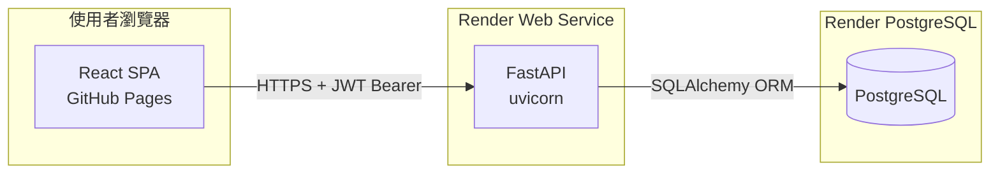
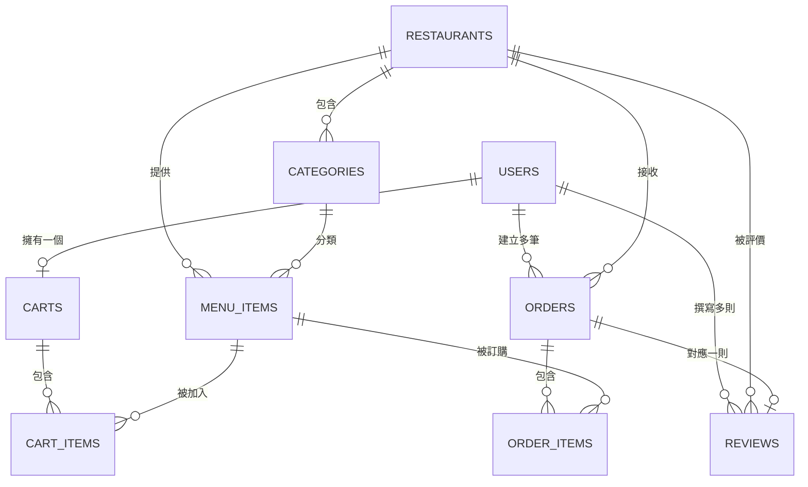

# 🍜 餐點外送系統

> 全端外送平台：以 **FastAPI + PostgreSQL** 建構 REST API，搭配 **React + Vite** 單頁前端，部署於 **Render（後端）** 與 **GitHub Pages（前端）**。
> 
> 測試帳號admin、密碼admin

[](https://github.com/chinglin-k/Render-test/actions/workflows/deploy-pages.yml)
[](https://www.python.org/)
[](https://fastapi.tiangolo.com/)
[](https://react.dev/)

---

## 目錄

- [線上體驗](#-線上體驗)
- [功能特色](#-功能特色)
- [系統架構](#-系統架構)
- [訂單狀態流程](#-訂單狀態流程)
- [技術棧](#-技術棧)
- [專案結構](#-專案結構)
- [資料模型](#-資料模型)
- [API 端點總覽](#-api-端點總覽)
- [前端頁面](#-前端頁面)
- [快速開始](#-快速開始)
- [環境變數](#-環境變數)
- [執行測試](#-執行測試)
- [部署指南](#-部署指南)
- [業務規則](#-業務規則)
- [角色權限對照](#-角色權限對照)
- [安全性說明](#-安全性說明)
- [疑難排解](#-疑難排解)
- [專案文件](#-專案文件)
- [未來規劃](#-未來規劃)
- [開發規範](#-開發規範)

---

## 🌐 線上體驗

| 服務 | URL |
|------|-----|
| **前端（GitHub Pages）** | [https://chinglin-k.github.io/Render-test/](https://chinglin-k.github.io/Render-test/) |
| **後端 API（Render）** | [https://render-test-ae9w.onrender.com](https://render-test-ae9w.onrender.com) |
| **Swagger API 文件** | [https://render-test-ae9w.onrender.com/docs](https://render-test-ae9w.onrender.com/docs) |
| **ReDoc API 文件** | [https://render-test-ae9w.onrender.com/redoc](https://render-test-ae9w.onrender.com/redoc) |

### 測試帳號

應用啟動時會自動建立以下管理員帳號（若不存在）：

| 帳號 | 密碼 | 角色 |
|------|------|------|
| `admin` | `admin` | 管理員（Admin） |

> 也可在前端「登入 / 註冊」頁面自行建立 **消費者（Consumer）** 或 **餐廳端（Restaurant）** 帳號。

### 範例優惠券

| 優惠碼 | 說明 | 類型 |
|--------|------|------|
| `WELCOME10` | 新會員九折，最低消費 $100 | 百分比折扣 10% |
| `SAVE50` | 滿 $300 折 $50 | 固定金額折扣 |

---

## ✨ 功能特色

### 消費者（Consumer）

- 瀏覽餐廳列表，支援關鍵字搜尋
- 查看餐廳菜單，依分類篩選、關鍵字搜尋
- 加入購物車、調整數量、移除品項
- 從購物車建立訂單（填寫外送地址）
- 查看訂單紀錄與即時狀態
- 取消尚未確認的訂單（`pending` 狀態）
- 對已完成訂單留下 1–5 星評價
- 在帳號管理頁面切換身份為餐廳端

### 餐廳端（Restaurant）

- 更新訂單狀態：確認 → 備餐 → 外送中 → 完成
- 在帳號管理頁面切換身份為消費者

### 管理員（Admin）

- 新增 / 編輯 / 停用餐廳（軟刪除）
- 新增菜單分類與餐點
- 管理所有使用者（查看、變更角色、停用 / 啟用）
- 建立與管理優惠券（百分比折扣 / 固定折抵）
- 透過管理後台進行完整 CRUD 操作

---

## 🏗️ 系統架構



| 層次 | 部署位置 | 說明 |
|------|---------|------|
| 前端 | GitHub Pages | React 18 SPA，透過 `VITE_API_BASE` 連接後端 |
| 後端 | Render Web Service | FastAPI + uvicorn，CORS 允許跨域 |
| 資料庫（正式） | Render PostgreSQL | 透過 `DATABASE_URL` 環境變數連線 |
| 資料庫（本地） | SQLite | 未設定 `DATABASE_URL` 時自動 fallback |
| CI/CD | GitHub Actions | `frontend/**` 變更時自動 build + deploy |

---

## 📦 訂單狀態流程

```
pending → confirmed → preparing → delivering → delivered
                                              ↘ cancelled
```

| 狀態 | 說明 | 可執行操作 |
|------|------|-----------|
| `pending` | 消費者已下單，等待餐廳確認 | 消費者可取消；餐廳可確認或取消 |
| `confirmed` | 餐廳已接單 | 餐廳可開始備餐 |
| `preparing` | 餐廳備餐中 | 餐廳可開始外送 |
| `delivering` | 外送中 | 餐廳可標記送達 |
| `delivered` | 已送達 | 消費者可留下評價 |
| `cancelled` | 已取消 | 訂單保留，不刪除（財務紀錄） |

> 購物車允許跨餐廳混合品項；建立訂單時後端會**依餐廳自動分組**，為每間餐廳分別建立一筆訂單。

---

## 🛠️ 技術棧

| 層次 | 技術 | 說明 |
|------|------|------|
| **後端框架** | FastAPI | 高效能 Python Web 框架，自動產生 OpenAPI 文件 |
| **ORM** | SQLAlchemy | 資料庫物件關係映射，支援 PostgreSQL / SQLite |
| **資料庫（正式）** | PostgreSQL (Render) | 雲端關聯式資料庫 |
| **資料庫（本地）** | SQLite | 自動 fallback，無需額外安裝 |
| **身份驗證** | JWT（python-jose + bcrypt） | Token 有效期 24 小時，密碼 bcrypt 雜湊 |
| **前端框架** | React 18 + Vite 5 | 單頁應用程式（SPA） |
| **前端路由** | React Router v6 | 客戶端路由，GitHub Pages SPA fallback |
| **CSS 設計** | Vanilla CSS | Django Admin 風格設計系統 |
| **CI/CD** | GitHub Actions | 自動建置並部署前端至 GitHub Pages |
| **測試** | pytest + httpx | 後端整合測試，SQLite in-memory |

---

## 📁 專案結構

```
0716/
├── main.py                  # 主程式入口：路由掛載、CORS、種子資料
├── database.py              # 資料庫連線（PostgreSQL / SQLite fallback）
├── models.py                # 10 張資料表的 SQLAlchemy ORM 模型
├── schemas.py               # Pydantic Schema（Create / Update / Response）
├── dependencies.py          # JWT 解析、bcrypt、角色驗證依賴
├── migration.sql            # 手動資料庫遷移腳本
├── render.yaml              # Render Blueprint 部署設定
├── requirements.txt         # Python 套件清單
├── .env.example             # 環境變數範例（不含實際值）
├── AGENTS.md                # AI 代理人與開發者協作規範
│
├── routers/                 # API 路由模組（每個模組一個檔案）
│   ├── auth.py              # 註冊、登入、取得個人資料、切換身份
│   ├── restaurants.py       # 餐廳瀏覽、菜單、評價
│   ├── cart.py              # 購物車 CRUD
│   ├── orders.py            # 訂單建立、查詢、取消、狀態更新
│   ├── reviews.py           # 訂單評價
│   ├── coupons.py           # 優惠券驗證
│   └── admin.py             # 管理後台 CRUD
│
├── tests/                   # pytest 整合測試（15 個測試案例）
│   ├── conftest.py          # 測試 fixtures（in-memory SQLite）
│   ├── test_auth.py
│   └── test_restaurants.py
│
├── doc/                     # 專案文件
│   ├── architecture.md      # 系統架構
│   ├── data-model.md        # 資料表設計與 ER 圖
│   ├── requirements.md      # 功能需求
│   ├── todo.md              # 開發進度
│   ├── test-plan.md         # 測試計畫
│   └── project-memory.md    # 重要決策記錄
│
├── frontend/                # React 前端（Vite）
│   ├── index.html           # HTML 入口 + SPA redirect handler
│   ├── package.json
│   ├── vite.config.js       # Vite 設定（base: /Render-test/）
│   ├── public/404.html      # GitHub Pages SPA fallback
│   └── src/
│       ├── main.jsx         # React 入口
│       ├── App.jsx          # 路由、導覽列、版面
│       ├── api.js           # API 呼叫模組（含 JWT 附加）
│       ├── index.css        # Django-inspired CSS 設計系統
│       └── pages/           # 7 個頁面元件
│           ├── LoginPage.jsx
│           ├── RestaurantsPage.jsx
│           ├── MenuPage.jsx
│           ├── CartPage.jsx
│           ├── OrdersPage.jsx
│           ├── AdminPage.jsx
│           └── AccountPage.jsx
│
└── .github/workflows/
    └── deploy-pages.yml     # GitHub Actions：自動部署前端
```

---

## 🗄️ 資料模型

共 **10 張資料表**，關聯如下：



| 資料表 | 主要欄位 | 說明 |
|--------|---------|------|
| `users` | name, email, password_hash, role, phone, is_active | 三種角色：consumer / restaurant / admin |
| `restaurants` | name, description, address, phone, is_active | 軟刪除（`is_active = false`）|
| `categories` | name, restaurant_id | 菜單分類 |
| `menu_items` | name, description, price, is_available | 餐點，含分類與餐廳關聯 |
| `carts` | user_id | 每位使用者一個購物車 |
| `cart_items` | cart_id, menu_item_id, quantity | 購物車品項 |
| `orders` | user_id, restaurant_id, total_amount, status, delivery_address | 訂單主檔 |
| `order_items` | order_id, menu_item_id, quantity, unit_price | 下單時價格快照 |
| `reviews` | order_id, rating, comment | 一訂單一評價，1–5 星 |
| `coupons` | code, discount_type, discount_value, min_order_amount | 優惠券 |

詳細欄位定義請參閱 [doc/data-model.md](./doc/data-model.md)。

---

## 🔌 API 端點總覽

共 **39 個端點**（含健康檢查）。所有需驗證的端點請在 Header 帶入：

```
Authorization: Bearer <JWT_TOKEN>
```

### Health（公開）

| 方法 | 端點 | 說明 |
|------|------|------|
| `GET` | `/` | 健康檢查，回傳 API 版本資訊 |

### Auth

| 方法 | 端點 | 權限 | 說明 |
|------|------|------|------|
| `POST` | `/auth/register` | 公開 | 註冊（consumer 或 restaurant） |
| `POST` | `/auth/login` | 公開 | 登入，回傳 JWT Token |
| `GET` | `/auth/me` | 需登入 | 取得目前登入使用者資訊 |
| `PUT` | `/auth/me/add-role` | 需登入 | 非 admin 切換自己的身份別 |

### Restaurants（公開）

| 方法 | 端點 | 說明 |
|------|------|------|
| `GET` | `/restaurants` | 餐廳列表（`?search=` 關鍵字搜尋） |
| `GET` | `/restaurants/{id}` | 餐廳詳情 |
| `GET` | `/restaurants/{id}/categories` | 菜單分類 |
| `GET` | `/restaurants/{id}/menu` | 菜單（`?search=&category_id=`） |
| `GET` | `/restaurants/{id}/reviews` | 餐廳評價列表 |

### Cart（需登入）

| 方法 | 端點 | 說明 |
|------|------|------|
| `GET` | `/cart` | 我的購物車 |
| `POST` | `/cart/items` | 加入品項（同品項自動累加數量） |
| `PUT` | `/cart/items/{id}` | 修改數量 |
| `DELETE` | `/cart/items/{id}` | 移除品項 |
| `DELETE` | `/cart` | 清空購物車 |

### Orders（需登入）

| 方法 | 端點 | 說明 |
|------|------|------|
| `POST` | `/orders` | 從購物車建立訂單（body: `delivery_address`） |
| `GET` | `/orders` | 我的訂單列表 |
| `GET` | `/orders/{id}` | 訂單詳情（含品項） |
| `DELETE` | `/orders/{id}` | 取消訂單（僅限 `pending`） |
| `PUT` | `/orders/{id}/status` | 更新狀態（restaurant / admin） |

### Reviews（需登入）

| 方法 | 端點 | 說明 |
|------|------|------|
| `POST` | `/reviews` | 評價已完成（`delivered`）訂單 |
| `GET` | `/reviews/my` | 我的評價列表 |

### Coupons（公開）

| 方法 | 端點 | 說明 |
|------|------|------|
| `GET` | `/coupons/validate/{code}` | 驗證優惠券有效性 |

### Admin（需 admin 角色）

| 方法 | 端點 | 說明 |
|------|------|------|
| `POST` | `/admin/restaurants` | 新增餐廳 |
| `GET` | `/admin/restaurants` | 查詢所有餐廳 |
| `PUT` | `/admin/restaurants/{id}` | 更新餐廳 |
| `DELETE` | `/admin/restaurants/{id}` | 停用餐廳（軟刪除） |
| `POST` | `/admin/restaurants/{id}/categories` | 新增菜單分類 |
| `POST` | `/admin/menu-items` | 新增餐點 |
| `PUT` | `/admin/menu-items/{id}` | 更新餐點 |
| `DELETE` | `/admin/menu-items/{id}` | 刪除餐點 |
| `GET` | `/admin/users` | 查詢所有使用者 |
| `PUT` | `/admin/users/{id}/role` | 設定使用者角色 |
| `PUT` | `/admin/users/{id}/deactivate` | 停用帳號 |
| `PUT` | `/admin/users/{id}/activate` | 啟用帳號 |
| `POST` | `/admin/coupons` | 新增優惠券 |
| `GET` | `/admin/coupons` | 查詢所有優惠券 |
| `PUT` | `/admin/coupons/{id}` | 更新優惠券 |
| `DELETE` | `/admin/coupons/{id}` | 刪除優惠券 |

---

## 🖥️ 前端頁面

| 頁面 | 路徑 | 需登入 | 功能 |
|------|------|:------:|------|
| 餐廳列表 | `/` | — | 搜尋 + 卡片瀏覽 |
| 登入 / 註冊 | `/login` | — | 表單切換，可選 consumer / restaurant |
| 餐廳菜單 | `/restaurant/:id` | — | 分類篩選、加入購物車、查看評價 |
| 購物車 | `/cart` | ✅ | 數量控制、填寫地址、下單 |
| 訂單紀錄 | `/orders` | ✅ | 狀態追蹤、取消、評價 |
| 管理後台 | `/admin` | ✅（admin） | 餐廳 / 菜單 / 用戶 / 優惠券 CRUD |
| 帳號管理 | `/account` | ✅ | 查看個人資料、切換身份別 |

前端採用 Django Admin 風格設計：淺色主題、`#417690` 導覽列、`#79aec8` 模組標題、簡潔表格排版。

---

## 🚀 快速開始

### 前置需求

- Python 3.10+
- Node.js 18+（建議 22，與 CI 一致）
- npm

### 後端

```bash
# 1. 複製環境變數範例（本地開發可跳過，自動使用 SQLite）
cp .env.example .env

# 2. 建立虛擬環境並安裝套件
python -m venv .venv
.venv\Scripts\activate        # Windows
# source .venv/bin/activate   # macOS / Linux

pip install -r requirements.txt

# 3. 啟動後端（自動建表 + 植入種子資料）
uvicorn main:app --reload

# API 文件：http://localhost:8000/docs
```

### 前端

```bash
cd frontend

# 1. 安裝套件
npm install

# 2. 啟動開發伺服器（Vite proxy 自動轉發至 localhost:8000）
npm run dev

# 前端：http://localhost:5173
```

### 種子資料

首次啟動後端時，若資料庫為空，會自動建立：

- 管理員帳號：`admin` / `admin`
- 3 間範例餐廳（好味道便當、鮮茶道、義式披薩屋）
- 12 道餐點（含分類）
- 2 張優惠券（`WELCOME10`、`SAVE50`）

---

## ⚙️ 環境變數

| 變數 | 必填 | 說明 | 預設值 |
|------|:----:|------|--------|
| `DATABASE_URL` | — | PostgreSQL 連線字串；未設定時使用 SQLite | `sqlite:///./local_dev.db` |
| `SECRET_KEY` | 正式環境必填 | JWT 簽發金鑰，至少 32 字元 | 開發用預設值（**正式環境請務必更換**） |

```bash
# 產生安全的 SECRET_KEY
python -c "import secrets; print(secrets.token_hex(32))"
```

> ⚠️ **絕對不要** 將 `.env` 提交至 Git。`.env` 已列入 `.gitignore`。

完整範例請參閱 [.env.example](./.env.example)。

---

## 🧪 執行測試

```bash
# 啟動虛擬環境後執行
pytest tests/ -v
```

測試使用 SQLite in-memory 資料庫，無需額外設定 `DATABASE_URL`。目前涵蓋 **15 個測試案例**，包含：

- 使用者註冊與登入
- 餐廳列表與搜尋篩選
- 未授權存取保護（401）
- 優惠券驗證
- 資源不存在處理（404）

---

## ☁️ 部署指南

### 後端（Render）

**方式一：手動建立**

1. 在 [Render Dashboard](https://dashboard.render.com) 建立 **Web Service**
2. 連結此 GitHub Repo
3. 設定環境變數：
   - `DATABASE_URL` — Render PostgreSQL 連線字串
   - `SECRET_KEY` — 強隨機字串（至少 32 字元）
4. Build Command：`pip install -r requirements.txt`
5. Start Command：`uvicorn main:app --host 0.0.0.0 --port $PORT`

**方式二：Blueprint（render.yaml）**

```bash
# 在 Render Dashboard 選擇「New Blueprint」，指向本 repo 的 render.yaml
```

> 應用啟動時會自動建表（`create_all`）並植入測試帳號與範例資料。若資料庫缺少新欄位（如 `users.is_active`），啟動程序會嘗試自動遷移。

### 前端（GitHub Pages）

前端透過 **GitHub Actions** 自動部署。每次推送至 `main` 分支且 `frontend/**` 有變更時觸發：

1. `npm ci` → `npm run build`
2. 上傳 `frontend/dist` 至 GitHub Pages

後端 API URL 在 workflow 中透過環境變數注入：

```yaml
# .github/workflows/deploy-pages.yml
env:
  VITE_API_BASE: https://render-test-ae9w.onrender.com
```

更換後端 URL 時，請同步修改此值與 `frontend/src/api.js` 中的 fallback。

### GitHub Pages 設定

在 Repo **Settings → Pages** 中確認：

- Source：**GitHub Actions**
- 自訂路徑：`/Render-test/`（與 `vite.config.js` 的 `base` 一致）

---

## 📋 業務規則

| 規則 | 說明 |
|------|------|
| 購物車跨餐廳 | 允許混合多間餐廳品項，下單時自動分組為多筆訂單 |
| 訂單不可刪除 | 取消僅更新 `status = cancelled`，保留財務紀錄 |
| 取消限制 | 消費者僅能取消 `pending` 狀態的訂單 |
| 評價限制 | 每筆訂單只能評價一次，且訂單須為 `delivered` |
| 餐廳軟刪除 | 停用餐廳設 `is_active = false`，不實際刪除 |
| 帳號停用 | `is_active = false` 的帳號無法登入或存取 API |
| 優惠券 | 目前僅提供驗證 API，尚未整合至訂單結帳流程 |
| JWT 有效期 | 24 小時，無 Refresh Token，過期需重新登入 |

---

## 🔐 角色權限對照

| 功能 | Consumer | Restaurant | Admin |
|------|:--------:|:----------:|:-----:|
| 瀏覽餐廳 / 菜單 | ✅ | ✅ | ✅ |
| 購物車 / 下訂單 | ✅ | ✅ | ✅ |
| 更新訂單狀態 | ❌ | ✅ | ✅ |
| 留下評價 | ✅ | ✅ | ✅ |
| 帳號管理（自己）| ✅ | ✅ | ✅ |
| 切換身份別 | ✅ → Restaurant | ✅ → Consumer | ❌（需透過後台）|
| 新增 / 管理餐廳 | ❌ | ❌ | ✅ |
| 管理所有使用者 | ❌ | ❌ | ✅ |
| 管理優惠券 | ❌ | ❌ | ✅ |

---

## 🔒 安全性說明

- 所有密碼使用 **bcrypt** 雜湊儲存，絕不明文
- API 端點使用 **JWT Bearer Token** 驗證，有效期 24 小時
- 敏感設定（`SECRET_KEY`、`DATABASE_URL`）一律透過環境變數注入
- `.env` 已加入 `.gitignore`，不會被提交
- 角色分離：每個 API 端點依最小權限原則設計
- CORS 目前允許所有來源（`allow_origins=["*"]`），正式上線建議限縮為 GitHub Pages 域名

---

## ❓ 疑難排解

| 問題 | 可能原因 | 解決方式 |
|------|---------|---------|
| 前端無法連接後端 | Render 免費方案冷啟動 | 等待 30–60 秒後重試 |
| 登入後立即 401 | Token 過期或 `SECRET_KEY` 不一致 | 重新登入；確認 Render 環境變數 |
| GitHub Pages 路由 404 | SPA 路由未正確 fallback | 確認 `public/404.html` 存在且 Pages 已啟用 Actions 部署 |
| 本地前端 API 失敗 | 後端未啟動 | 先執行 `uvicorn main:app --reload` |
| pytest 失敗 | 虛擬環境未啟用或套件未安裝 | `pip install -r requirements.txt` |
| Render 啟動崩潰 | 舊資料庫缺少新欄位 | 啟動程序會自動嘗試 `ALTER TABLE`；或手動執行 `migration.sql` |

---

## 📚 專案文件

| 文件 | 說明 |
|------|------|
| [doc/requirements.md](./doc/requirements.md) | 功能需求與使用者角色 |
| [doc/architecture.md](./doc/architecture.md) | 系統架構與模組說明 |
| [doc/data-model.md](./doc/data-model.md) | 資料表設計、ER 圖、索引建議 |
| [doc/todo.md](./doc/todo.md) | 開發進度與待辦事項 |
| [doc/project-memory.md](./doc/project-memory.md) | 重要技術決策記錄 |
| [doc/test-plan.md](./doc/test-plan.md) | 測試計畫 |
| [AGENTS.md](./AGENTS.md) | AI 代理人與開發者協作規範 |

---

## 🔮 未來規劃（Phase 3）

- [ ] **Alembic 資料庫遷移** — 取代目前的手動 `ALTER TABLE`
- [ ] **圖片上傳** — 整合 Cloudinary 或 AWS S3
- [ ] **推播通知** — WebSocket 即時訂單狀態更新
- [ ] **優惠券與訂單整合** — 結帳時自動套用折扣
- [ ] **Refresh Token** — 延長 JWT 有效期，支援主動撤銷
- [ ] **CORS 限縮** — 正式環境僅允許 GitHub Pages 域名

---

## 📄 開發規範

本專案遵循 [AGENTS.md](./AGENTS.md) 規範，重點包括：

- 技術棧選型與專案結構約定
- 安全性規範（禁止硬編碼機密）
- Git Commit 格式：`<type>: <簡短說明>`
- API 設計規範（JSON 回應、HTTP 狀態碼）
- 文件維護規則

---

## 👥 貢獻

1. Fork 本專案
2. 建立功能分支（`git checkout -b feat/your-feature`）
3. 提交變更（`git commit -m 'feat: add some feature'`）
4. 推送分支（`git push origin feat/your-feature`）
5. 開啟 Pull Request

---

*Powered by FastAPI 🐍 + React ⚛️ | Deployed on Render ☁️ + GitHub Pages 📄*
