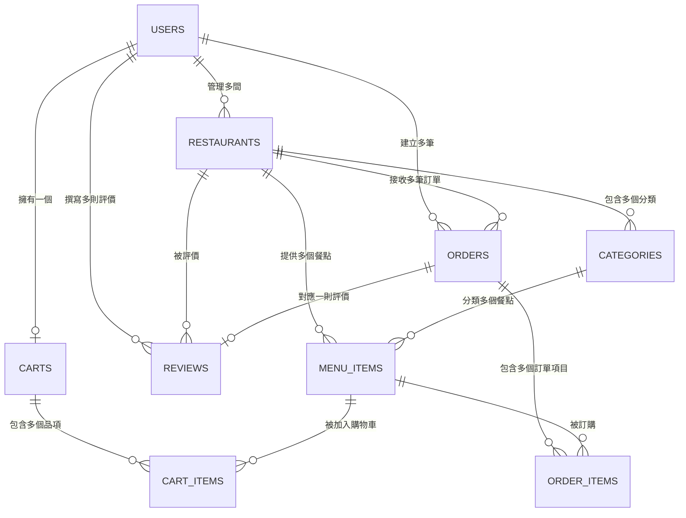

# 資料模型文件

> 依據 `/doc/requirements.md` 與 `/doc/architecture.md` 產生  
> 最後更新：2026-07-16

---

## 一、ER Diagram（Mermaid）

---

## 二、核心實體與欄位說明

### 2.1 `users` — 使用者

| 欄位 | SQL 型別 | 可空 | 說明 |
|------|---------|------|------|
| `id` | INTEGER | NOT NULL | 主鍵，自動遞增 |
| `name` | VARCHAR(100) | NOT NULL | 顯示名稱 |
| `email` | VARCHAR(255) | NOT NULL | 帳號，全域唯一 |
| `password_hash` | VARCHAR(255) | NOT NULL | bcrypt 雜湊，不儲存明文 |
| `role` | VARCHAR(20) | NOT NULL | `consumer` / `restaurant` / `admin` |
| `phone` | VARCHAR(20) | NULL | 聯絡電話 |
| `created_at` | TIMESTAMPTZ | NOT NULL | 建立時間，DB 預設 NOW() |

**主鍵：** `id`  
**唯一索引：** `email`  
**驗證規則：**
- `email` 須符合 email 格式（由應用層驗證）
- `role` 只允許三種固定值
- `name` 長度 1–100 字元

**敏感資料：** `password_hash` — 不得出現在 API 回應中；`email` 為個人資料，須加密傳輸（HTTPS）

---

### 2.2 `restaurants` — 餐廳

| 欄位 | SQL 型別 | 可空 | 說明 |
|------|---------|------|------|
| `id` | INTEGER | NOT NULL | 主鍵 |
| `name` | VARCHAR(100) | NOT NULL | 餐廳名稱 |
| `description` | TEXT | NULL | 餐廳描述 |
| `address` | VARCHAR(255) | NULL | 地址 |
| `phone` | VARCHAR(20) | NULL | 電話 |
| `owner_id` | INTEGER | NULL | FK → `users.id` |
| `is_active` | BOOLEAN | NOT NULL | 是否上架（預設 TRUE）|
| `created_at` | TIMESTAMPTZ | NOT NULL | 建立時間 |

**主鍵：** `id`  
**外鍵：** `owner_id` → `users(id)`  
**建議索引：** `is_active`（常用篩選條件）  
**資料生命週期：** 停用（`is_active = FALSE`）而非實際刪除，保留歷史訂單關聯

---

### 2.3 `categories` — 菜單分類

| 欄位 | SQL 型別 | 可空 | 說明 |
|------|---------|------|------|
| `id` | INTEGER | NOT NULL | 主鍵 |
| `name` | VARCHAR(50) | NOT NULL | 分類名稱（如：主食、飲料）|
| `restaurant_id` | INTEGER | NOT NULL | FK → `restaurants.id` |

**主鍵：** `id`  
**外鍵：** `restaurant_id` → `restaurants(id)` ON DELETE CASCADE  
**建議索引：** `restaurant_id`

---

### 2.4 `menu_items` — 餐點

| 欄位 | SQL 型別 | 可空 | 說明 |
|------|---------|------|------|
| `id` | INTEGER | NOT NULL | 主鍵 |
| `name` | VARCHAR(100) | NOT NULL | 餐點名稱 |
| `description` | TEXT | NULL | 餐點描述 |
| `price` | NUMERIC(10,2) | NOT NULL | 單價（正數）|
| `is_available` | BOOLEAN | NOT NULL | 是否可訂購（預設 TRUE）|
| `category_id` | INTEGER | NULL | FK → `categories.id` |
| `restaurant_id` | INTEGER | NOT NULL | FK → `restaurants.id` |

**主鍵：** `id`  
**外鍵：** `category_id` → `categories(id)`；`restaurant_id` → `restaurants(id)` ON DELETE CASCADE  
**建議索引：** `(restaurant_id, is_available)`（複合索引）  
**驗證規則：** `price > 0`  
**資料生命週期：** 實際刪除（CASCADE），或設為 `is_available = FALSE` 保留歷史訂單參考

---

### 2.5 `carts` — 購物車

| 欄位 | SQL 型別 | 可空 | 說明 |
|------|---------|------|------|
| `id` | INTEGER | NOT NULL | 主鍵 |
| `user_id` | INTEGER | NOT NULL | FK → `users.id`，唯一（一人一車）|
| `created_at` | TIMESTAMPTZ | NOT NULL | 建立時間 |

**主鍵：** `id`  
**外鍵：** `user_id` → `users(id)` ON DELETE CASCADE  
**唯一約束：** `user_id`（每位使用者只有一個購物車）  
**資料生命週期：** 隨訂單建立後清空 `cart_items`，`carts` 本身保留

---

### 2.6 `cart_items` — 購物車品項

| 欄位 | SQL 型別 | 可空 | 說明 |
|------|---------|------|------|
| `id` | INTEGER | NOT NULL | 主鍵 |
| `cart_id` | INTEGER | NOT NULL | FK → `carts.id` |
| `menu_item_id` | INTEGER | NOT NULL | FK → `menu_items.id` |
| `quantity` | INTEGER | NOT NULL | 數量（≥ 1）|

**主鍵：** `id`  
**外鍵：** `cart_id` → `carts(id)` ON DELETE CASCADE；`menu_item_id` → `menu_items(id)`  
**建議索引：** `cart_id`  
**驗證規則：** `quantity >= 1`  
**資料生命週期：** 建立訂單後批次刪除

---

### 2.7 `orders` — 訂單

| 欄位 | SQL 型別 | 可空 | 說明 |
|------|---------|------|------|
| `id` | INTEGER | NOT NULL | 主鍵 |
| `user_id` | INTEGER | NOT NULL | FK → `users.id` |
| `restaurant_id` | INTEGER | NOT NULL | FK → `restaurants.id` |
| `total_amount` | NUMERIC(10,2) | NOT NULL | 訂單總金額（正數）|
| `status` | VARCHAR(20) | NOT NULL | 訂單狀態（預設 `pending`）|
| `delivery_address` | VARCHAR(255) | NULL | 外送地址 |
| `created_at` | TIMESTAMPTZ | NOT NULL | 建立時間 |

**主鍵：** `id`  
**外鍵：** `user_id` → `users(id)`；`restaurant_id` → `restaurants(id)`  
**建議索引：** `user_id`、`restaurant_id`、`status`  
**驗證規則：**
- `status` 只允許：`pending` / `confirmed` / `preparing` / `delivering` / `delivered` / `cancelled`
- `total_amount > 0`  
**資料生命週期：** 永久保留，不刪除（財務紀錄）

---

### 2.8 `order_items` — 訂單品項

| 欄位 | SQL 型別 | 可空 | 說明 |
|------|---------|------|------|
| `id` | INTEGER | NOT NULL | 主鍵 |
| `order_id` | INTEGER | NOT NULL | FK → `orders.id` |
| `menu_item_id` | INTEGER | NOT NULL | FK → `menu_items.id` |
| `quantity` | INTEGER | NOT NULL | 數量 |
| `unit_price` | NUMERIC(10,2) | NOT NULL | 下單當時單價（歷史快照）|

**主鍵：** `id`  
**外鍵：** `order_id` → `orders(id)` ON DELETE CASCADE；`menu_item_id` → `menu_items(id)`  
**建議索引：** `order_id`  
**說明：** `unit_price` 為下單時的快照，不隨餐點價格更動

---

## 三、索引建議彙總

| 資料表 | 索引欄位 | 原因 |
|--------|---------|------|
| `users` | `email` (UNIQUE) | 登入查詢 |
| `restaurants` | `is_active` | 篩選上架餐廳 |
| `menu_items` | `(restaurant_id, is_available)` | 菜單查詢 |
| `cart_items` | `cart_id` | 購物車品項查詢 |
| `orders` | `user_id`、`restaurant_id`、`status` | 訂單查詢與狀態篩選 |
| `order_items` | `order_id` | 訂單詳情查詢 |
| `reviews` | `restaurant_id`、`order_id` (UNIQUE) | 餐廳評價查詢、防止重複 |
| `coupons` | `code` (UNIQUE) | 優惠券驗證查詢 |

---

## 四、敏感資料處理方式

| 資料 | 處理方式 |
|------|---------|
| 密碼 | bcrypt 雜湊儲存，API 回應不包含 `password_hash` |
| JWT Token | 伺服器端不儲存，由 `SECRET_KEY` 驗證 |
| `SECRET_KEY` | 環境變數注入，不得寫入程式碼或 Git |
| `DATABASE_URL` | 環境變數注入（Render 自動設定）|
| Email | 個人資料，僅 HTTPS 傳輸，不對外暴露 |

---

## 五、資料生命週期摘要

| 資料 | 建立時機 | 更新時機 | 刪除時機 |
|------|---------|---------|---------|
| `users` | 註冊 | 角色變更、停用/啟用 | 不刪除 |
| `restaurants` | 管理員建立 | 資訊更新、停用 | 軟刪除（`is_active`）|
| `menu_items` | 管理員建立 | 資訊/價格更新 | 實際刪除或下架 |
| `carts` | 首次加入品項 | — | 不刪除 |
| `cart_items` | 加入購物車 | 修改數量 | 建立訂單後清空 |
| `orders` | 從購物車下單 | 狀態更新、取消 | 不刪除（財務保存）|
| `order_items` | 隨訂單建立 | — | 隨訂單刪除（CASCADE）|
| `reviews` | 消費者評價 delivered 訂單 | — | 不刪除 |
| `coupons` | 管理員建立 | 更新折扣/停用 | 可實際刪除 |

---

## 六、Phase 2 新增實體

### 6.1 `reviews` — 訂單評價

| 欄位 | SQL 型別 | 可空 | 說明 |
|------|---------|------|------|
| `id` | INTEGER | NOT NULL | 主鍵 |
| `order_id` | INTEGER | NOT NULL | FK → `orders.id`，唯一（一訂單一評價）|
| `user_id` | INTEGER | NOT NULL | FK → `users.id` |
| `restaurant_id` | INTEGER | NOT NULL | FK → `restaurants.id` |
| `rating` | INTEGER | NOT NULL | 1–5 星 |
| `comment` | TEXT | NULL | 文字評論 |
| `created_at` | TIMESTAMPTZ | NOT NULL | 建立時間 |

**唯一約束：** `order_id`（每筆訂單只能評價一次）
**驗證規則：** `rating` 在 1–5 之間；訂單 `status` 必須為 `delivered`

---

### 6.2 `coupons` — 優惠券

| 欄位 | SQL 型別 | 可空 | 說明 |
|------|---------|------|------|
| `id` | INTEGER | NOT NULL | 主鍵 |
| `code` | VARCHAR(50) | NOT NULL | 優惠碼（唯一，大寫儲存）|
| `description` | TEXT | NULL | 描述 |
| `discount_type` | VARCHAR(20) | NOT NULL | `percentage` 或 `fixed` |
| `discount_value` | FLOAT | NOT NULL | 折扣值（百分比或固定金額）|
| `min_order_amount` | FLOAT | NOT NULL | 最低消費門檻（預設 0）|
| `is_active` | BOOLEAN | NOT NULL | 是否啟用 |
| `expires_at` | TIMESTAMPTZ | NULL | 到期時間（空 = 永不過期）|
| `created_at` | TIMESTAMPTZ | NOT NULL | 建立時間 |

**唯一約束：** `code`
**驗證規則：** `discount_value > 0`；`discount_type` 僅允許 `percentage` / `fixed`

---

## 七、待確認事項

> ⚠️ 以下項目尚未確認業務規則，實作前須釐清：

1. **購物車跨餐廳限制**：目前允許混合多間餐廳的品項於同一購物車，建立訂單時自動分組。是否需要限制同一次只能向一間餐廳訂購？
2. **餐點圖片欄位**：目前 `menu_items` 未包含圖片 URL。是否需要新增 `image_url` 欄位？
3. **`price` 型別**：目前使用 `Float`（SQLAlchemy），建議正式環境改用 `NUMERIC(10,2)` 避免浮點誤差。
4. **優惠券訂單整合**：目前僅提供驗證 API，是否需要在建立訂單時自動折抵？（需新增 `orders.discount_amount`）
