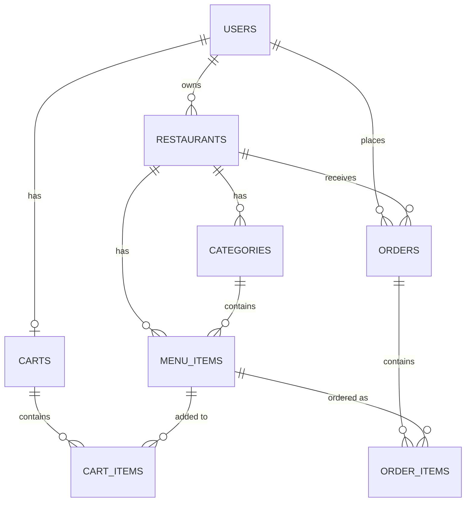

# 資料模型文件

## ER Diagram

## 資料表說明

### users
| 欄位 | 型別 | 說明 |
|------|------|------|
| id | Integer PK | 自動遞增 |
| name | String | 姓名 |
| email | String UNIQUE | 帳號（用於登入）|
| password_hash | String | bcrypt 雜湊密碼 |
| role | String | consumer / restaurant / admin |
| phone | String? | 電話 |
| created_at | DateTime | 建立時間 |

### restaurants
| 欄位 | 型別 | 說明 |
|------|------|------|
| id | Integer PK | |
| name | String | 餐廳名稱 |
| description | String? | 描述 |
| address | String? | 地址 |
| phone | String? | 電話 |
| owner_id | FK users | 負責人 |
| is_active | Boolean | 是否上架 |

### categories
| 欄位 | 型別 | 說明 |
|------|------|------|
| id | Integer PK | |
| name | String | 分類名稱（如：主食、飲料）|
| restaurant_id | FK restaurants | |

### menu_items
| 欄位 | 型別 | 說明 |
|------|------|------|
| id | Integer PK | |
| name | String | 餐點名稱 |
| description | String? | 描述 |
| price | Float | 單價 |
| is_available | Boolean | 是否可訂購 |
| category_id | FK categories? | |
| restaurant_id | FK restaurants | |

### carts
| 欄位 | 型別 | 說明 |
|------|------|------|
| id | Integer PK | |
| user_id | FK users UNIQUE | 每位用戶一個購物車 |

### cart_items
| 欄位 | 型別 | 說明 |
|------|------|------|
| id | Integer PK | |
| cart_id | FK carts | |
| menu_item_id | FK menu_items | |
| quantity | Integer | 數量 |

### orders
| 欄位 | 型別 | 說明 |
|------|------|------|
| id | Integer PK | |
| user_id | FK users | |
| restaurant_id | FK restaurants | |
| total_amount | Float | 總金額 |
| status | String | 訂單狀態 |
| delivery_address | String? | 外送地址 |
| created_at | DateTime | |

### order_items
| 欄位 | 型別 | 說明 |
|------|------|------|
| id | Integer PK | |
| order_id | FK orders | |
| menu_item_id | FK menu_items | |
| quantity | Integer | 數量 |
| unit_price | Float | 下單當時單價（歷史記錄）|
